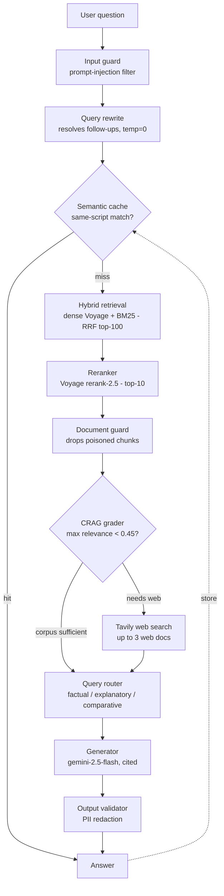

# Bilingual CRAG Assistant

A self-correcting **German–Russian** retrieval-augmented assistant that answers
language-learning questions from a library of textbooks, **with page-level
citations** — and knows when the books don't hold the answer, falling back to a
web search instead of guessing.

**Built for** a professional German–Russian translator who studies from a shelf
of grammar and vocabulary books and wants exact, sourced answers in either
language. A second **Pipeline Inspector** view exposes every retrieval and
reasoning step live, so the system can be inspected end to end.

**Walkthrough:** [3-minute demo video](https://www.loom.com/share/f470eadf0b4f4c50a83f0c3fb8ebbb98) — the
system answering real questions, including one the books don't cover so the web
fallback takes over. It runs there on the private library it was built for; the
repository ships the system, and **you point it at your own PDFs**
([how](#2-index-your-own-corpus)).

> **Runs locally with Docker Compose.** Bring your own document corpus and your
> own API keys — nothing here is tied to a specific account or dataset.


<!-- SCREENSHOT GOES HERE.
     Add it on github.com: open this file -> pencil icon -> drag the image into
     the editor at this line. GitHub uploads it and inserts the markdown for
     you, so no image file needs to live in the repository.
     Good candidates: the Pipeline Inspector with the animated CRAG diagram, or
     a web-fallback query. Avoid any screen that shows textbook pages. -->


---

## The problem

A learner reading across 20+ bilingual textbooks has a real retrieval problem:
the answer to "when do you use *zu* + Dative for direction?" or a Russian-language
query like *«как называется по-немецки цвет волос белокурый»* is on one page of
one book, often in the other language, sometimes only in a scanned image. Plain
keyword search misses it; a general chatbot invents a plausible-but-wrong answer
with no source. This system retrieves the actual page, answers in the question's
language, cites the book and page, and **refuses or searches the web when the
corpus genuinely doesn't cover the question** instead of hallucinating.

---

## How it works

A question flows through a hybrid retriever, a self-correction grader, and a
generator — with a semantic cache in front and three security guards around it.



1. **Guard + rewrite + cache.** An input guard blocks obvious prompt-injection;
   a temperature-0 rewriter resolves elliptical follow-ups ("and in the
   accusative?"); a Redis semantic cache returns instantly on a repeat question —
   but only when the cached question is in the *same script*, so a German answer
   never leaks into a Russian query.
2. **Hybrid retrieval.** Dense multilingual embeddings (Voyage) find meaning
   across languages; BM25 catches the exact word. Reciprocal-rank fusion merges
   both, then a cross-encoder reranker lifts the single most relevant page to the
   top.
3. **CRAG self-correction.** A grader scores each retrieved chunk. If the best
   chunk is below threshold, the corpus doesn't cover the question and a **Tavily
   web search** joins the context; otherwise the corpus answer stands. This is
   the difference between "sorry, not in the books" and a useful answer.
4. **Generate + validate.** A type-aware generator answers in the question's
   language with book-and-page citations; an output validator redacts PII. The
   answer is cached for next time.

Full rationale for every choice above is in
[`ARCHITECTURE.md`](ARCHITECTURE.md); the measured results are in
[`EVALUATION.md`](EVALUATION.md).


---

## Key decisions and their tradeoffs

- **Vanilla FastAPI, no orchestration framework.** One file per concern
  (`query_rewriter`, `semantic_cache`, `crag_critic`, `web_search`, `security`),
  explicit cost tracking, a direct SSE stream the UI reads verbatim. Tradeoff: no
  off-the-shelf component graph — replaced by the custom Pipeline Inspector view.
- **`voyage-multilingual-2` (1024d) over a 2048d model.** Measured P@10 within
  0.002 of the larger model, at half the vector size and storage cost. A tiny
  accuracy delta did not justify doubling the index.
- **CRAG + web fallback over cross-lingual routing.** The dominant failure mode
  in this corpus is *out-of-corpus* questions (e.g. Swedish vocabulary), not
  language routing — so agency was spent on "is the answer even in here?".
  **The web-search trigger is a threshold I control, not a decision I hand to the
  LLM.**
- **Client-side chat history.** Conversations live in `localStorage`, never on a
  server: no state to migrate on redeploy, offline-readable, and private by
  default — appropriate for someone typing their own vocabulary mistakes.
- **Graceful degradation everywhere.** Redis, the web search, and observability
  are each individually optional at runtime; pull any one and the system still
  answers, just with less augmentation.

---

## Tech stack

| Layer | Choice |
|---|---|
| Backend | Python 3.11, **FastAPI**, SSE streaming |
| Vector store | **Qdrant** (hybrid dense + sparse, RRF) |
| Embeddings | **Voyage** `voyage-multilingual-2` (dense) + **BM25** (sparse) |
| Reranker | Voyage `rerank-2.5` |
| Generator + graders | **Google** `gemini-2.5-flash` |
| Cache + memory | **Redis** (RediSearch/HNSW semantic cache + sliding-window memory) |
| Web fallback | **Tavily** search API |
| Observability | **Opik** (Comet ML) with a JSONL fallback |
| Frontend | **Next.js 16** + React 19 + Tailwind 4 + TypeScript |
| Runtime | **Docker Compose** (backend + frontend) |

---

## Run it locally

Three steps: keys, corpus, stack. The corpus step is the one people skip — the
app has nothing to retrieve until you have run it.

### 1. Clone and configure

```bash
git clone https://github.com/SnowCartman/Bilingual-CRAG-Assistant
cd Bilingual-CRAG-Assistant
cp .env.example .env      # then fill in your own keys
```

Only Qdrant, Voyage, and Gemini keys are required. Redis, Tavily, and Opik are
optional and degrade gracefully if absent — pull any of them and the system
still answers, with less augmentation. See [`.env.example`](.env.example).

### 2. Index your own corpus

This repository ships the *system*, not the documents it was built for (a
personal library of copyrighted textbooks). Point it at your own PDFs:

```bash
pip install -r requirements-ingest.txt
python scripts/ingest.py --source ./data/books --collection my_books_hybrid
```

The script extracts each PDF, splits it into 2000-character structure-aware
chunks, embeds them twice (Voyage dense vectors **and** BM25 sparse vectors),
and upserts them into a Qdrant collection with book-and-page payloads — the
exact shape the query path expects. Put the collection name in `.env` as
`QDRANT_COLLECTION`.

**Scanned books** have no text layer, and the default extractor will report zero
text for them. Those need OCR: install [marker-pdf](https://github.com/datalab-to/marker)
(`pip install marker-pdf`) and pass `--extractor marker`. Marker pulls in torch;
on CPU it is slow enough to be impractical for a whole shelf, while on a CUDA
GPU it is roughly an order of magnitude faster. Two of the scanned dictionaries
in the original corpus were only usable because of it.

### 3. Start the stack

```bash
docker compose up --build
```

Open <http://localhost:3000>. The backend serves on `:8000` (`/health`,
`/query`, `/query/stream`, `/feedback`, `/admin/cache/clear`).

### 4. Make the UI yours

The interface ships describing the corpus it was built for: the example
questions on the start screen, the welcome line above them, and the overview
panel behind the doll icon in the header. Those are **content, not code** — all
of it lives in one file:

```
frontend/lib/content.json
```

| Key | What it drives |
|---|---|
| `welcome` | Headline + subtitle on the empty chat screen |
| `chips` | The clickable example questions (`label` is the button, `query` is what gets asked) |
| `overview.intro` | The paragraph in the overview panel |
| `overview.stats` | The four figures next to it — books, pages, chunks, top-k |
| `overview.statsNote` | The caption under the figures |

Edit it, then `docker compose up --build frontend`. Nothing in `components/`
needs touching. Pick chips your own corpus can actually answer, and keep one
that it *cannot* — watching the web fallback take over is the most convincing
thing this system does.

The right-hand column of the overview panel describes the pipeline itself and is
the same for every deployment, so it stays in the component. The doll icon
(`frontend/components/matryoshka.tsx`) is a nod to the Russian half of the
corpus — swap it if you want your own mark.

---

## Repository layout

```
app/                    FastAPI backend
  main.py               endpoints
  config.py             pydantic-settings (.env-driven)
  services/             rag_pipeline, query_rewriter, query_router,
                        semantic_cache, security, observability, session_memory
  augmentations/        CRAG critic + Tavily web search
  prompts/              type-aware templates + registry
frontend/               Next.js app — Chat view + Pipeline Inspector view
  lib/content.json      every corpus-specific string the UI shows (edit this)
scripts/
  ingest.py             PDFs -> chunks -> Qdrant (run this first)
  *_smoke.py            guard / router / CRAG / observability smoke tests
  eval_*.py             evaluation + calibration harnesses
compose.yaml            backend + frontend
requirements-backend.txt  serving image deps
requirements-ingest.txt   indexing deps (kept out of the serving image)
ARCHITECTURE.md         why each layer is the way it is
EVALUATION.md           how retrieval + answers were measured
```

---

## Author

Built by **Matthias Schütze** — [GitHub](https://github.com/SnowCartman)
<!-- Fill in when ready: · [LinkedIn](URL) · [email](mailto:ADRESSE) -->

> Built as part of The AI Engineering Accelerator by NeoSage Academy.
> https://academy.neosage.io
